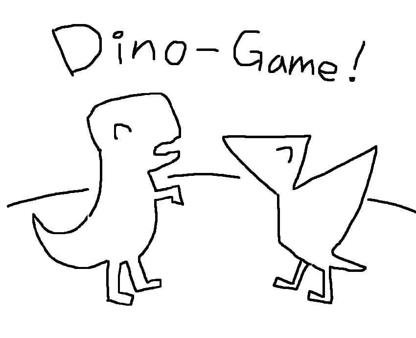
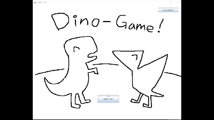
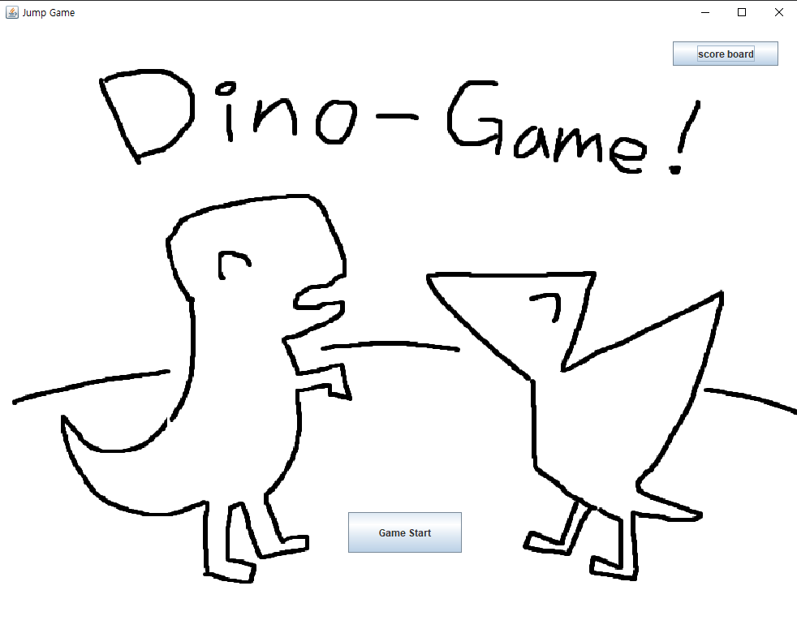
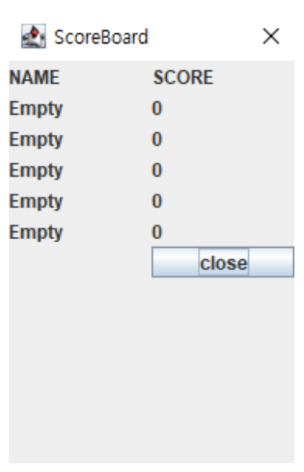
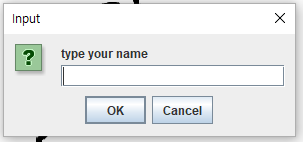
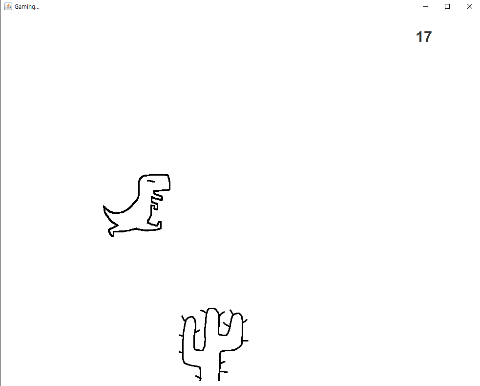
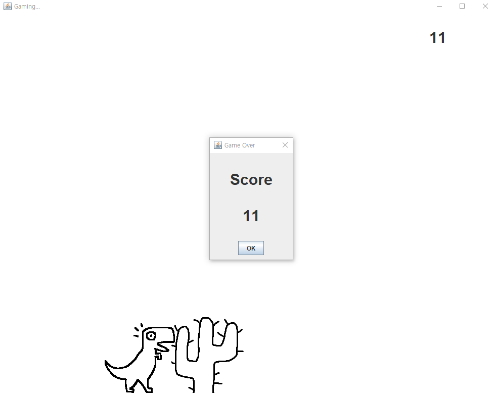

 
<h1>Dino🦖 Jump Game!</h1>

자바를 이용해 구현한 크롬 공룡 게임 오마주

***

- 플레이 영상
  

 

***

- 프로그램 설명

 

1. 메인화면 Dino-Game! 
   
   바로 보이다시피 크롬의 공룡게임을 오마주하였다.

   중앙하단에 게임시작버튼과 우측상단의 점수확인 버튼이 있다.

   익룡친구는 시간관계로 등장하지 못하였다.

 

 

2. 점수판 
   
   점수판이다. 상위 5개의 기록이 순서대로 표시된다

 

 

3. 이름 입력

    사용자 이름을 입력한다. 

    해당 이름으로 점수판에 기록되게 되며, 매번 새로 입력해줘야 한다 

 

 

4. 게임 화면

    게임을 하는 화면이다. 
    
    공룡은 space바를 누르면 점프하고 선인장은 랜덤한 속도로 다가온다. 
    
    타이밍에 맞춰 오랫동안 살아남는 게임이다. 
    
    우측상단 점수는 시간에 비례하여 올라간다. 

 

 

5. 게임 오버
   
    공룡이 화들짝놀란다. 
    
    선인장을 피하지못했을경우 게임 오버가 되고, 현재 점수가 게임오버창에 표시된다.
    
    해당점수는 입력한 이름과 함께 점수판에
저장장되어 메인화면에서 확인할 수 있게된다. 

    오케이 버튼을 누르면
메인화면으로 돌아간다. 

